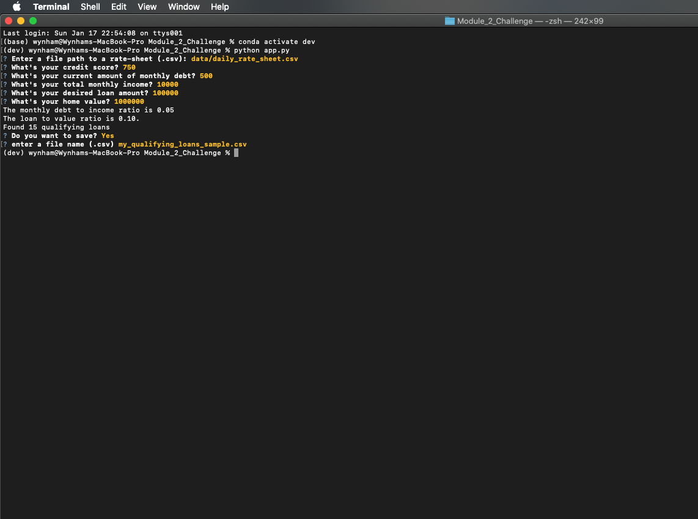

# Module 2 Challenge: Loan Qualifier Application!

This project is designed to help a user determine the number of loans a user qualifies for based on their financial information. The program asks the user to enter a file path to a rate-sheet. This file includes a list of banks with their loan qualifications. The program then asks them a series of financial questions. 

Once the user inputs financial infomation, the program runs calculations and cross references the results with the bank list. The program then returns the users monthly debt to income ratio, loan to value ratio, and the number of loans they qualify for.

If the user qualifies for loans, the program will ask if the user would like to save their qualifying loans to a .csv file. If they select yes, they then can then enter their .csv file name and it will save a file in .csv format in the folder.

---

## Technologies

[fire](fire) - for the command line interface

[questionary](questionary) - gives ability to interact with the user and recieve user input in program

[sys](sys) - system-specific parameters and functions

[csv](csv) - for reading and writing .csv files

---

## Installation Guide

Install the following in your conda dev environment

```python
pip install fire
pip install questionary
pip install pytest
```

---

## Examples

make sure you activate your conda dev environment (python 3.7) before running the code:
```
conda activate dev
```
When prompted for .csv file, enter the following for this program:
```
data/daily_rate_sheet.csv
```
---

## Usage

This image shows an example of an user entering their information in the loan qualifier application:



---

## Contributors

UCB Fintech Bootcamp, Wynham Guillemot 

---

## License

MIT License

Copyright (c) [2021] [UCB Fintech Bootcamp, Wyham Guillemot]

Permission is hereby granted, free of charge, to any person obtaining a copy
of this software and associated documentation files (the "Software"), to deal
in the Software without restriction, including without limitation the rights
to use, copy, modify, merge, publish, distribute, sublicense, and/or sell
copies of the Software, and to permit persons to whom the Software is
furnished to do so, subject to the following conditions:

The above copyright notice and this permission notice shall be included in all
copies or substantial portions of the Software.

THE SOFTWARE IS PROVIDED "AS IS", WITHOUT WARRANTY OF ANY KIND, EXPRESS OR
IMPLIED, INCLUDING BUT NOT LIMITED TO THE WARRANTIES OF MERCHANTABILITY,
FITNESS FOR A PARTICULAR PURPOSE AND NONINFRINGEMENT. IN NO EVENT SHALL THE
AUTHORS OR COPYRIGHT HOLDERS BE LIABLE FOR ANY CLAIM, DAMAGES OR OTHER
LIABILITY, WHETHER IN AN ACTION OF CONTRACT, TORT OR OTHERWISE, ARISING FROM,
OUT OF OR IN CONNECTION WITH THE SOFTWARE OR THE USE OR OTHER DEALINGS IN THE
SOFTWARE.